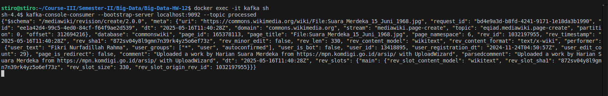
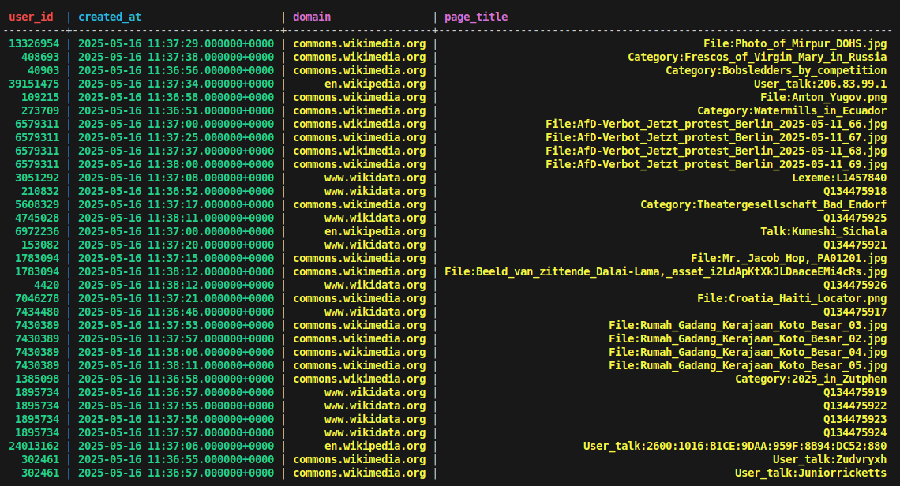

# Big-Data-HW-12

Author: Davyd Ilnytskyi

---

# Results

1. Скрипти запуску і видалення інсталяції Spark Streaming (або docker-compose файл з описом як ним користуватися)
2. Скрипти запуску і видалення інсталяції Kafka (або docker-compose файл з описом як ним користуватися)
3. Скрипти запуску і видалення інсталяції Cassandra (або docker-compose файл з описом як ним користуватися)\
**Запуск**
```
bash run-cluster.sh
```

**Зупинка**
```
bash shutdown-cluster.sh
```

4. Програмний код всіх компонентів (програма для читання потоку з ендпоїнта і запису в kafka, 2 програми Spark Streaming)
- wikipedia endpoint -> kafka: ./kafka-producer/main.py
- kafka -> kafka: ./spark/main.py
- kafka -> cassandra: ./spark/submain.py
5. Скріншоти з:
- результатами читання консольними клієнтами з kafka топіків\


- результатами запитів до Cassandra\
`select * from wiki_data.results;`



---

# Useful commands:

__Spark Kafka-Kafka submission__:
```
spark-submit --master local[1] --packages org.apache.spark:spark-sql-kafka-0-10_2.12:3.5.0 /opt/bitnami/spark/data/main.py
```

__Spark Kafka-Cassandra submission__:
```
spark-submit --master local[1] --packages org.apache.spark:spark-sql-kafka-0-10_2.12:3.5.0,com.datastax.spark:spark-cassandra-connector_2.12:3.5.0 --conf spark.cassandra.connection.host=cassandra --conf spark.cassandra.auth.username=cassandra --conf spark.cassandra.auth.password=uncommonpass /opt/bitnami/spark/data/submain.py
```

__Kafka Listeners__:
```
kafka-console-consumer --bootstrap-server localhost:9092 --topic input --from-beginning
```

```
kafka-console-consumer --bootstrap-server localhost:9092 --topic processed --from-beginning
```
