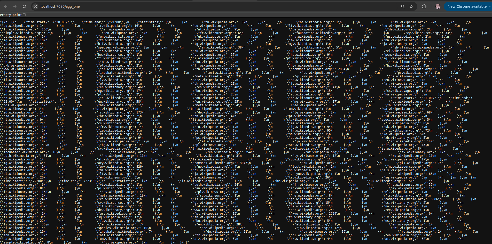
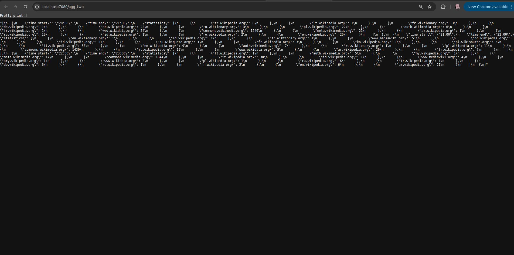
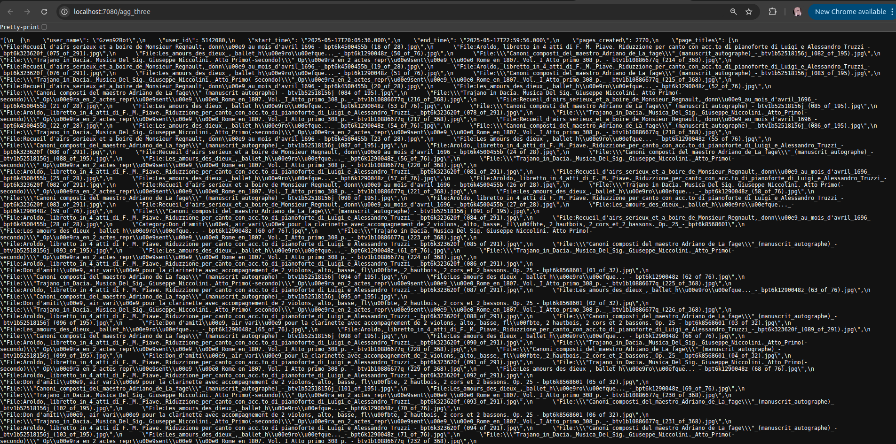
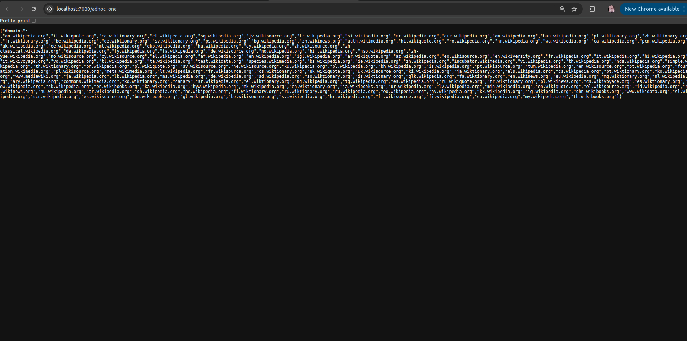
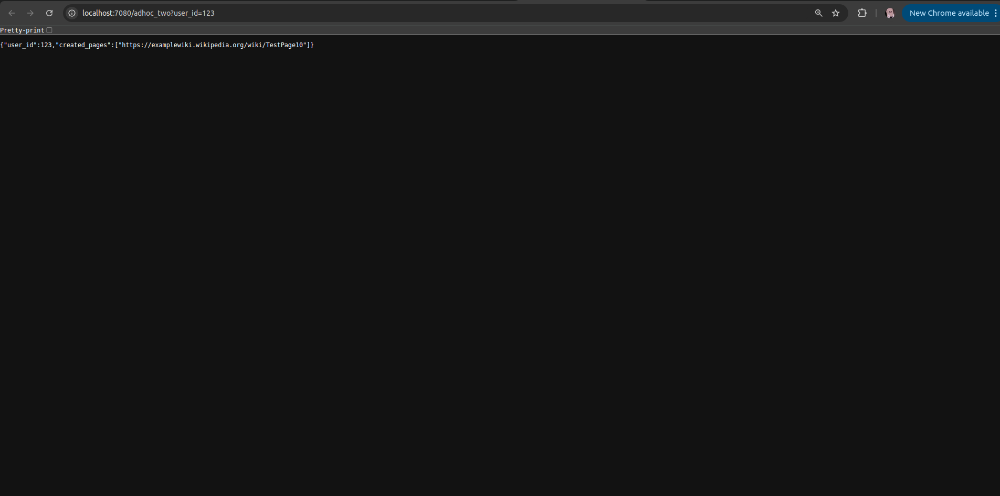
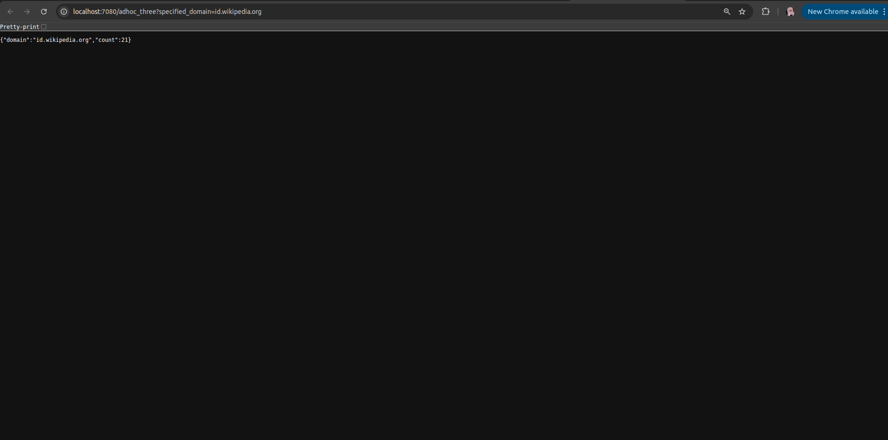
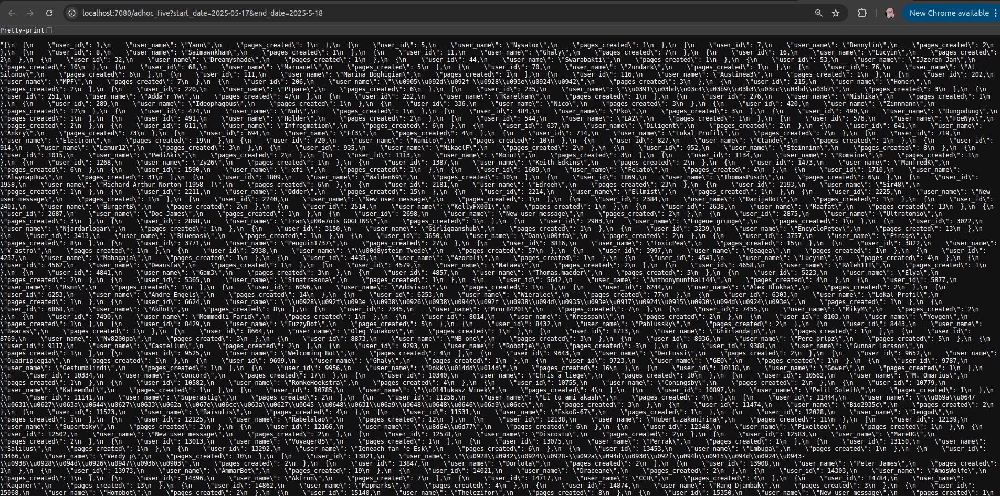

# Big-Data-HW-12

Author: Davyd Ilnytskyi

---

# Design

Data Fetching | Python Server -> Kafka Queue -> Spark Server -> Kafka Queue -> Spark -> Cassandra -> WebServer

### Data fetching - Python Server

Main reason:
- Easy to use

### Data transfering - Two Kafka Queues

Main reason:
- Easy to use
Gives an ability to work on different operations in parallel:
- 1 spark stream cleans input queue data and sends it to processed queue
- 1 spark stream processes processed queue and passes it to the tables

### Data processing - Spark Node
Main reason:
- Easy to use
- Easy to work with streaming data

### Data saving - Cassandra
- Easy to use

---

## Diagrams:
1. Agg_one
+-----------------------------+
|         agg_one            |
+-----------------------------+
| domain     (PK)            |
| date       (PK)            |
| hour       (PK)            |
| count      (counter)       |
+-----------------------------+
2. Agg_two
+-----------------------------+
|         agg_two            |
+-----------------------------+
| domain     (PK)            |
| date       (PK)            |
| hour       (PK)            |
| count      (counter)       |
+-----------------------------+
3. Agg_three
+----------------------------------------------------+
|                    agg_three                       |
+----------------------------------------------------+
| user_id      (PK)                                  |
| date         (PK)                                  |
| hour         (PK)                                  |
| timestamp    (CK)                                  |
| user_name                                          |
| page_title                                         |
+----------------------------------------------------+

1. Adhoc_one
+-----------------------------+
|        adhoc_one           |
+-----------------------------+
| domain      (PK)           |
| count       (counter)      |
+-----------------------------+

2. Adhoc_two
+----------------------------------------+
|              adhoc_two                |
+----------------------------------------+
| user_id     (PK)                      |
| timestamp   (CK)                      |
| url                                   |
+----------------------------------------+
3. Adhoc_four
+----------------------------------------+
|              adhoc_four               |
+----------------------------------------+
| page_id     (PK)                      |
| timestamp   (CK)                      |
| url                                   |
+----------------------------------------+
4. Adhoc_five
+----------------------------------------------------+
|                  adhoc_five                        |
+----------------------------------------------------+
| user_id     (PK)                                   |
| timestamp   (PK)                                   |
| hour        (CK)                                   |
| user_name                                          |
| date                                               |
+----------------------------------------------------+

----
# Work demonstration

1. http://localhost:7080/agg_one

2. http://localhost:7080/agg_two

3. http://localhost:7080/agg_three

4. http://localhost:7080/adhoc_one

5. http://localhost:7080/adhoc_two?user_id=123

6. http://localhost:7080/adhoc_three?specified_domain=id.wikipedia.org

7. http://localhost:7080/adhoc_four?page_id=165480052

8. http://localhost:7080/adhoc_five?start_date=2025-05-17&end_date=2025-5-18

** Example of jsons for each request are in ./jsons directory. **